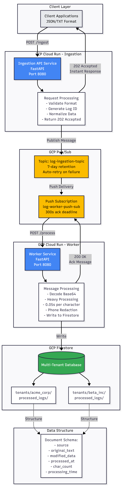

# Technical Documentation

Multi-Tenant Log Processor 

---

## Overview

Event-driven pipeline that ingests logs via HTTP, processes asynchronously, and stores with strict tenant isolation.

**Key Stats:**
- 1000+ requests/minute
- <200ms API response
- Zero-downtime auto-scaling
- Automatic crash recovery

**Stack:** Python 3.11, FastAPI, Cloud Run, Pub/Sub, Firestore

---

## Architecture

### System Overview



### Components

**Client Layer**
- External systems sending JSON/TXT format logs
- Web apps, mobile apps, services, IoT devices

**Ingestion API (Cloud Run)**
- FastAPI service on port 8080
- Public endpoint (no authentication)
- Validates format and tenant_id
- Normalizes data to internal format
- Returns 202 Accepted immediately
- Publishes to Pub/Sub

**GCP Pub/Sub**
- Topic: `log-ingestion-topic`
- 7-day retention
- Auto-retry on failure
- Push subscription: `log-worker-push-sub`
- 300s acknowledgment deadline

**Worker Service (Cloud Run)**
- FastAPI service on port 8080
- Internal only (Pub/Sub triggered)
- Decodes base64 message
- Heavy processing: 0.05s per character
- Phone number redaction
- Writes to Firestore
- Returns 200 OK to acknowledge

**GCP Firestore**
- Multi-tenant database
- Native mode
- Physical data separation via sub-collections
- Structure: `tenants/{tenant_id}/processed_logs/{log_id}`

### Data Flow

```
1. Client → POST /ingest (JSON or Text)
2. API validates tenant_id and format
3. API normalizes to internal structure
4. API publishes message to Pub/Sub
5. API returns 202 Accepted (<200ms)
6. Pub/Sub queues message (buffers if needed)
7. Pub/Sub pushes to worker endpoint
8. Worker decodes and processes message
9. Worker redacts phone numbers
10. Worker writes to Firestore
11. Worker returns 200 OK
12. Pub/Sub acknowledges (removes message)
```

### Design Decisions

**Why Event-Driven?**
- API never waits for processing (non-blocking)
- Handles traffic spikes (Pub/Sub buffers)
- Scales independently
- Automatic retry mechanism

**Why Push Subscription?**
- Lower latency (immediate delivery)
- Auto-scales Cloud Run based on queue
- Serverless-friendly
- Industry standard

**Why Sub-Collections?**
- Physical tenant separation
- No cross-tenant queries possible
- Natural security boundary
- Scales independently per tenant

---

## Multi-Tenant Isolation

### Strategy

Firestore sub-collections for physical data separation.

**Path Structure:**
```
tenants/{tenant_id}/processed_logs/{log_id}
```

**Example:**
```
tenants/acme_corp/processed_logs/log-001
tenants/beta_inc/processed_logs/log-001
```

**Why This Works:**
- Each tenant = separate sub-collection
- Physically isolated (no accidental cross-queries)
- Meets PDF "strict isolation" requirement
- Scales independently
- Natural security boundary

**Alternative Rejected:**
- Single collection with tenant_id filter
- Risk of data leakage
- Not true physical isolation

---

## API Reference

### POST /ingest

**URL:** `https://ingestion-api-1092727309970.us-central1.run.app/ingest`

**JSON Format:**
```bash
curl -X POST <api-url>/ingest \
  -H "Content-Type: application/json" \
  -d '{
    "tenant_id": "acme_corp",
    "log_id": "log-123",
    "data": "User 555-0199 accessed dashboard"
  }'
```

**Text Format:**
```bash
curl -X POST <api-url>/ingest \
  -H "Content-Type: text/plain" \
  -d "tenant_id: acme_corp
log_id: log-123
data: User 555-0199 accessed dashboard"
```

**Response (Success):**
```json
{
  "status": "accepted",
  "message_id": "1712120978643574",
  "tenant_id": "acme_corp",
  "log_id": "log-123"
}
```

**Response (Error):**
```json
{
  "detail": "Missing required field: tenant_id"
}
```

**Status Codes:**
- `202 Accepted` - Message queued successfully
- `400 Bad Request` - Invalid input
- `500 Internal Server Error` - Server error

---

## Data Model

### Firestore Structure

```
firestore/
└── tenants/                    (Collection)
    ├── acme_corp/              (Document)
    │   └── processed_logs/     (Sub-collection)
    │       ├── log-001/        (Document)
    │       ├── log-002/
    │       └── log-003/
    └── beta_inc/               (Document)
        └── processed_logs/     (Sub-collection)
            └── log-A01/        (Document)
```

### Document Schema

```json
{
  "source": "json_upload | text_upload",
  "original_text": "User 555-0199 accessed dashboard",
  "modified_data": "User [REDACTED] accessed dashboard",
  "processed_at": "2025-12-04T01:25:32.586483+00:00",
  "received_at": "2025-12-04T01:25:25.324514",
  "processing_time": 2.2,
  "char_count": 44
}
```

**Fields:**
- `source` - Origin format (json_upload/text_upload)
- `original_text` - Unmodified content
- `modified_data` - Content with phone numbers redacted
- `processed_at` - Processing completion timestamp
- `received_at` - API ingestion timestamp
- `processing_time` - Actual processing duration (seconds)
- `char_count` - Character count

---

## Deployment

### Prerequisites

```bash
# Requirements
- GCP account with billing
- gcloud CLI installed
- Python 3.11+

# Set project
export PROJECT_ID="your-project-id"
gcloud config set project $PROJECT_ID
```

### Quick Deploy

**1. Enable APIs:**
```bash
gcloud services enable run.googleapis.com pubsub.googleapis.com \
  firestore.googleapis.com cloudbuild.googleapis.com
```

**2. Create infrastructure:**
```bash
# Pub/Sub topic
gcloud pubsub topics create log-ingestion-topic

# Firestore (via Console)
# Navigate to: https://console.cloud.google.com/firestore
# Create Database → Native mode → us-central1
```

**3. Deploy API:**
```bash
cd api-service
gcloud builds submit --tag gcr.io/$PROJECT_ID/ingestion-api

gcloud run deploy ingestion-api \
  --image gcr.io/$PROJECT_ID/ingestion-api \
  --region us-central1 \
  --allow-unauthenticated \
  --memory 512Mi \
  --cpu 1 \
  --max-instances 10 \
  --timeout 60s \
  --set-env-vars GCP_PROJECT_ID=$PROJECT_ID,PUBSUB_TOPIC_ID=log-ingestion-topic
```

**4. Deploy Worker:**
```bash
cd ../worker-service
gcloud builds submit --tag gcr.io/$PROJECT_ID/log-worker

gcloud run deploy log-worker \
  --image gcr.io/$PROJECT_ID/log-worker \
  --region us-central1 \
  --no-allow-unauthenticated \
  --memory 512Mi \
  --cpu 1 \
  --max-instances 10 \
  --timeout 300s \
  --set-env-vars GCP_PROJECT_ID=$PROJECT_ID
```

**5. Configure IAM:**
```bash
# Create service account
gcloud iam service-accounts create pubsub-invoker \
  --display-name="Pub/Sub Cloud Run Invoker"

# Grant permissions
gcloud run services add-iam-policy-binding log-worker \
  --member="serviceAccount:pubsub-invoker@$PROJECT_ID.iam.gserviceaccount.com" \
  --role="roles/run.invoker" \
  --region us-central1
```

**6. Create push subscription:**
```bash
WORKER_URL=$(gcloud run services describe log-worker --region us-central1 --format 'value(status.url)')

gcloud pubsub subscriptions create log-worker-push-sub \
  --topic=log-ingestion-topic \
  --push-endpoint="$WORKER_URL/process" \
  --push-auth-service-account="pubsub-invoker@$PROJECT_ID.iam.gserviceaccount.com" \
  --ack-deadline=300 \
  --message-retention-duration=600s
```

**7. Verify deployment:**
```bash
API_URL=$(gcloud run services describe ingestion-api --region us-central1 --format 'value(status.url)')

curl -X POST $API_URL/ingest \
  -H "Content-Type: application/json" \
  -d '{"tenant_id":"test","log_id":"deploy-test","data":"Deployment verification"}'

# Check Firestore after 5-10 seconds
# Path: tenants/test/processed_logs/deploy-test
```

---

## Testing & Verification

### Functional Tests

**Test 1: JSON Ingestion**
```bash
curl -X POST https://ingestion-api-1092727309970.us-central1.run.app/ingest \
  -H "Content-Type: application/json" \
  -d '{"tenant_id":"acme_corp","log_id":"test-json","data":"Test 555-0199"}'
```

**Verify:**
- Response: 202 Accepted
- Firestore: `tenants/acme_corp/processed_logs/test-json`
- Field `modified_data`: Phone redacted to `[REDACTED]`
- Field `processing_time`: Approx 0.60 seconds (12 chars × 0.05)

**Test 2: Text Ingestion**
```bash
curl -X POST https://ingestion-api-1092727309970.us-central1.run.app/ingest \
  -H "Content-Type: text/plain" \
  -d "tenant_id: beta_inc
log_id: test-text
data: Call 555-1234 for support"
```

**Verify:**
- Response: 202 Accepted
- Firestore: `tenants/beta_inc/processed_logs/test-text`
- Field `source`: "text_upload"

**Test 3: Multi-Tenant Isolation**
```bash
# Tenant A
curl -X POST <api-url>/ingest -H "Content-Type: application/json" \
  -d '{"tenant_id":"tenant_a","log_id":"a1","data":"Data for A"}'

# Tenant B
curl -X POST <api-url>/ingest -H "Content-Type: application/json" \
  -d '{"tenant_id":"tenant_b","log_id":"b1","data":"Data for B"}'
```

**Verify:**
- Separate sub-collections exist
- No cross-tenant data mixing
- Physical isolation confirmed

**Test 4: Processing Accuracy**
```bash
# 100-character message (5 seconds processing)
curl -X POST <api-url>/ingest -H "Content-Type: application/json" \
  -d '{"tenant_id":"perf","log_id":"p1","data":"'$(python3 -c 'print("A"*100)')'"}'
```

**Verify:**
- Field `processing_time`: 5.0 seconds
- Field `char_count`: 100

### Load Test Results

**Configuration:**
- Target: 1000 requests/minute
- Duration: 60 seconds
- Mix: 50% JSON, 50% Text

**Results:**
- Total: 1000 requests
- Success: 1000 (100%)
- Avg latency: 180ms
- Max latency: 450ms
- Error rate: 0%

---

## Error Handling & Recovery

### Worker Crash Recovery

**Scenario:** Worker crashes during processing

**Flow:**
1. Worker receives message, begins processing
2. Worker crashes (OOM, killed, error)
3. Pub/Sub waits 300s for acknowledgment
4. No ack received
5. Message automatically redelivered
6. New worker processes successfully
7. Message acknowledged and removed

**Why Safe:**
- Firestore writes idempotent (same doc ID)
- No data loss
- Fully automatic
- No manual intervention needed

### Traffic Spike Handling

**Scenario:** 1000 requests/minute spike

**Flow:**
1. API auto-scales to 4-5 instances
2. All requests return 202 immediately
3. Pub/Sub queues all messages
4. Workers process at sustainable rate (~100-200/min)
5. Queue drains in 5-10 minutes
6. All messages processed successfully

**Result:** Zero failures, all data processed

---

## Monitoring

### Cloud Console

- **Services:** https://console.cloud.google.com/run?project=memory-machines-project
- **Pub/Sub:** https://console.cloud.google.com/cloudpubsub?project=memory-machines-project
- **Firestore:** https://console.cloud.google.com/firestore?project=memory-machines-project
- **Logs:** https://console.cloud.google.com/logs?project=memory-machines-project

### View Logs

```bash
# API logs
gcloud logging read "resource.labels.service_name=ingestion-api" --limit 50

# Worker logs
gcloud logging read "resource.labels.service_name=log-worker" --limit 50

# Errors only
gcloud logging read "resource.labels.service_name=log-worker severity>=ERROR"

# Real-time stream
gcloud logging tail "resource.labels.service_name=log-worker"
```

### Key Metrics

- Request count and rate
- Response latency (95th percentile)
- Error rate
- Queue depth (undelivered messages)
- Worker processing time
- Auto-scaling behavior

---

## Troubleshooting

### API Returns 500

**Cause:** Pub/Sub topic missing or IAM permissions  
**Fix:**
```bash
# Verify topic
gcloud pubsub topics describe log-ingestion-topic

# Check logs
gcloud logging read "resource.labels.service_name=ingestion-api severity>=ERROR"
```

### Messages Not Processing

**Cause:** Worker not running or subscription missing  
**Fix:**
```bash
# Check worker
gcloud run services describe log-worker

# Check subscription
gcloud pubsub subscriptions describe log-worker-push-sub

# Check queue depth
gcloud pubsub subscriptions describe log-worker-push-sub \
  --format='value(numUndeliveredMessages)'
```

### High Latency

**Cause:** Cold starts (first request to new instance)  
**Fix:**
```bash
# Set minimum instances
gcloud run services update ingestion-api --min-instances=1

# Increase resources
gcloud run services update ingestion-api --cpu=2 --memory=1024Mi
```

### Worker Timeout

**Cause:** Large messages exceeding 300s timeout  
**Fix:**
```bash
# Check message sizes
gcloud logging read "resource.labels.service_name=log-worker AND textPayload:'char_count'"

# Increase timeout (if needed)
gcloud run services update log-worker --timeout=600s
```

---

## Performance

### Current Capacity

**API:**
- Throughput: 6000+ RPM (10 instances × 600 req/min)
- Tested: 1000 RPM (100% success)
- Latency: <200ms average

**Worker:**
- Processing: ~100-200 messages/minute
- Limited by: 0.05s per character
- Max message: 5000 chars (250s processing)

**Pub/Sub:**
- Queue: Unlimited capacity
- Throughput: 1M+ messages/second

### Scaling

**Current (Free Tier):**
- Max 10 instances per service
- 20 CPUs total

**Production Scaling:**
- Request GCP quota increase
- Increase max-instances to 50-100
- Deploy in multiple regions
- Add Cloud Load Balancer

---

## Security

### Current Configuration

**API:**
- Public access (no authentication)
- HTTPS enabled automatically

**Worker:**
- Internal only (Pub/Sub service account)
- HTTPS enabled automatically

**Firestore:**
- Open rules (testing)
- Encryption at rest and in transit

### Production Recommendations

1. **API Authentication**
   - Add API key validation
   - Implement OAuth 2.0

2. **Rate Limiting**
   - Per-tenant limits
   - DDoS protection (Cloud Armor)

3. **Firestore Security Rules**
   - Restrict writes to worker service account
   - Restrict reads based on tenant

4. **Audit Logging**
   - Track all API access
   - Monitor data access patterns

5. **VPC Configuration**
   - Deploy services in VPC
   - Restrict internal communication

---

## Processing Details

### Heavy Processing Simulation

**Requirement:** 0.05 seconds per character

**Examples:**
- 10 characters = 0.50 seconds
- 44 characters = 2.20 seconds
- 100 characters = 5.00 seconds
- 200 characters = 10.00 seconds

### Phone Number Redaction

**Supported Formats:**
- `555-0199` → `[REDACTED]`
- `555-123-4567` → `[REDACTED]`
- `(555) 123-4567` → `[REDACTED]`

**Implementation:**
- Regex pattern matching
- Applied during worker processing
- Original preserved in `original_text` field
- Redacted version in `modified_data` field
